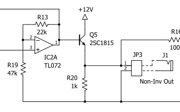

# エンベロープ・ジェネレータ回路の初版からの変更点

エンベロープ・ジェネレータ回路は初版の時点の版から変更されています。変更点は以下の通りです。部品が追加されたため、改訂版向けの基板は初版向けのものから変更されています。

### 変更点

エンベロープジェネレータ出力段のエミッタフォロワを保護する抵抗 R21 を加えました。

新回路

旧回路

### 理由

初版の回路では、Q5 のエミッタフォロワ回路がそのまま JP3 経由で出力されています。JP3 にインピーダンスの非常に小さな負荷をつないでエンベロープ・ジェネレータを作動させると、Q5 が破損してしまう問題がありました。これを防ぐため、改訂版では Q5 を保護する抵抗 R21 が追加されています。

出力の低インピーダンス状態は、JP3 出力を誤って GND にショートさせてしまうと簡単に発生します。