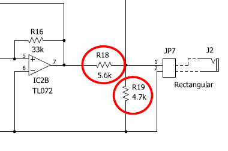
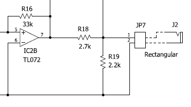

# LFO回路の初版からの変更点

LFO回路は初版の時点の版から変更されています。変更点は以下の通りです。回路定数の変更ですから、基板の設計は初版のものと同じままです。

### 変更点

矩形波出力を減衰させる抵抗 R18 と R19 の値を変更しました。

新回路

旧回路

### 理由

LFO回路の消費電流を小さくするためです。矩形波出力の消費電流が大きいと、電源電圧に影響を与えてしまい、それによりおなじライフラインにつないだ VCO のピッチが不安定になります。変更後 LFO 電源経由で VCO に影響を与える度合いが小さくなりました。