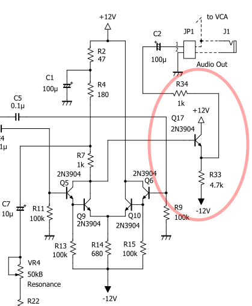
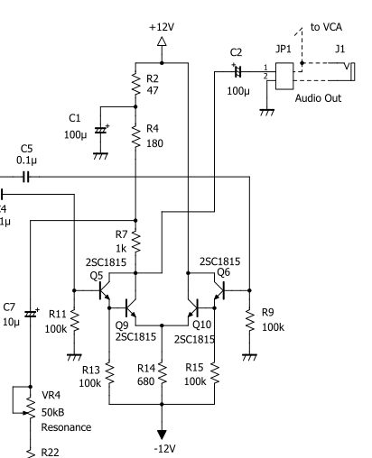

# VCF 回路の初版からの変更点

VCF 回路は初版の時点の版から変更されています。変更点は以下の通りです。部品が追加されたため、改訂版向けの基板は初版向けのものから変更されています。

### 変更点

出力段にエミッタフォロワを入れました。

新回路

旧回路

### 理由

初版の回路では、JP1 経由の出力に低インピーダンスの負荷をつなげると、これが Q5, Q6, Q9, Q10 で構成した差動増幅器の出力に影響を与え、レゾナンスがうまく働かない問題がありました。この問題を避けるため、改訂版では出力段にエミッタフォロワを入れ、出力インピーダンスが差動増幅器に干渉しないようにしました。
