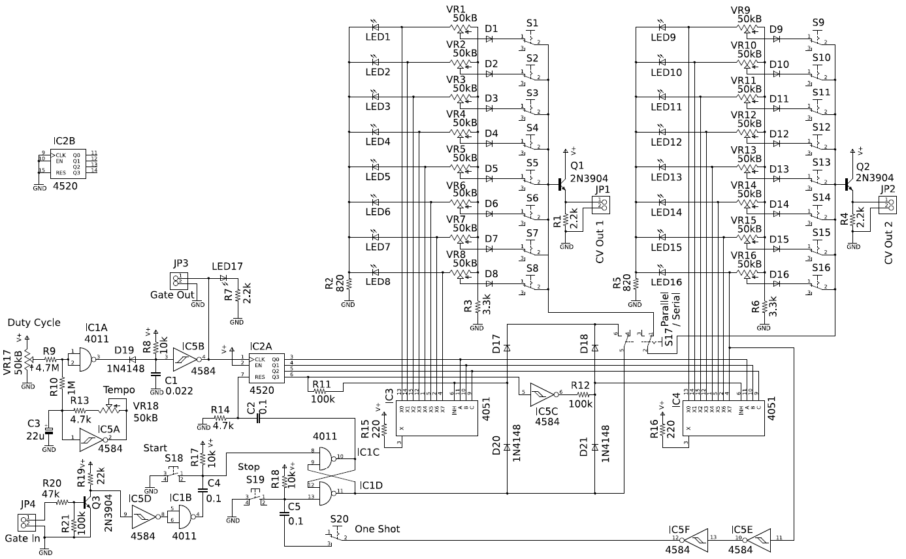

# アナログシーケンサ

## 概要

アナログシーケンサはCVを発生するボリュームが並んでおり、これを逐次切り替えることでCVのパタンを発生します。ここでの作例は、8ステップのシーケンサが2個並んだ構造になっています。これを直列に走らせると16ステップ1系統のシーケンサになります。並列に走らせると8ステップ2系統のシーケンサになります。parrarel/serialスイッチで切り換えられます。また、One ShotスイッチをONにすると、一回だけシーケンスを再生して停止します。

CVは、Parrarelモードでは、CV Out1、CV Out2から別々に2系統が出力されます。Serialモードでは、CV Out1、CV Out2どちらからも同等の16ステップ分の一系統が出力されます。

## このディレクトリに含まれるリソース

- analog_sequencer_sch.pdf, analog_sequencer_sch.png: 回路図イメージファイル
- Eagle ファイル、Eagle ver. 5.12 で作成しています。プリント基板レイアウトファイルは未作成です。
  - eagle/eagle.epf - プロジェクトファイル
  - eagle/analog_sequencer.sch - 回路図ファイル

## 回路図

