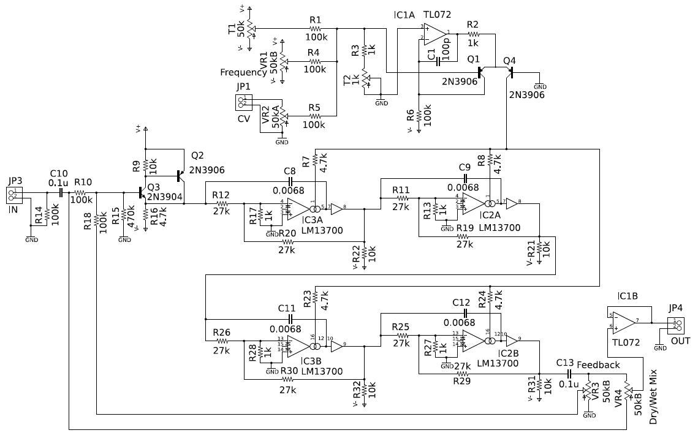

# フェーズシフタ

## 概要

フェーズシフタはシンセサイザーのモジュールというより、どちらかというとエフェクタとしてよく知られています。もともとは回転スピーカの効果に似た音を得るために考案されたようですが、実のところあまり似ていません。それでも、音がうねるような独特の面白い効果が得られることから重宝されているエフェクタです。回路図は次ページの通りです。

## このディレクトリに含まれるリソース

- phase_shifter_sch.pdf, phase_shifter_sch.png: 回路図イメージファイル
- Eagle ファイル、Eagle ver. 5.12 で作成しています
  - eagle/eagle.epf - プロジェクトファイル
  - eagle/phaser.sch - 回路図ファイル
  - eagle/phaser.brd - 基板レイアウトファイル

## 回路図

