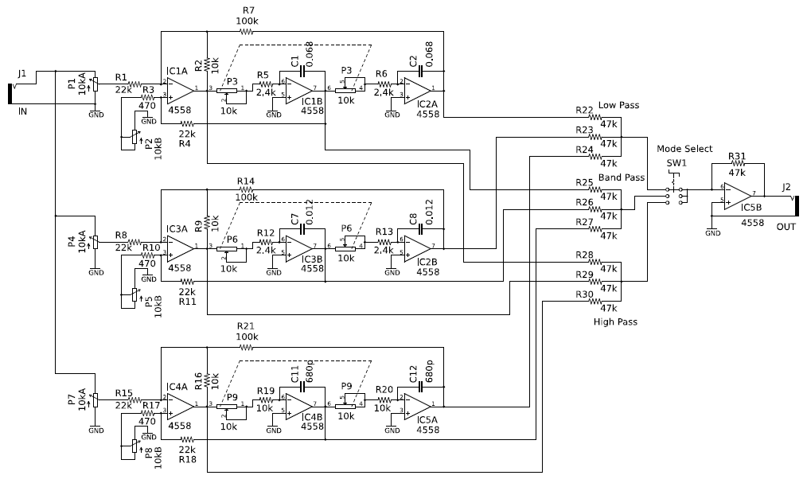

# レゾネータ

## 概要

レゾネータは「共振器」という意味です。入力信号に周波数特性のピークをつけるフィルタです。グラフィックイコライザと比べて一般的にバンド数が少なく、その代わりフィルタの中心周波数と共振の鋭さが細かく調整できます。こういったフィルタは楽器固有の共鳴などの現象と同じような効果を得るのに向いているため、音声に似た音を作ったり、楽器音をより本物らしくしたりできます。このレゾネータは3個のフィルタを持っています。

## このディレクトリに含まれるリソース

- resonator_sch.pdf, resonator_sch.png: 回路図イメージファイル
- Eagle ファイル、Eagle ver. 5.12 で作成しています
  - eagle/eagle.epf - プロジェクトファイル
  - eagle/resonator2.sch - 回路図ファイル
  - eagle/resonator2.brd - 基板レイアウトファイル

## 回路図

