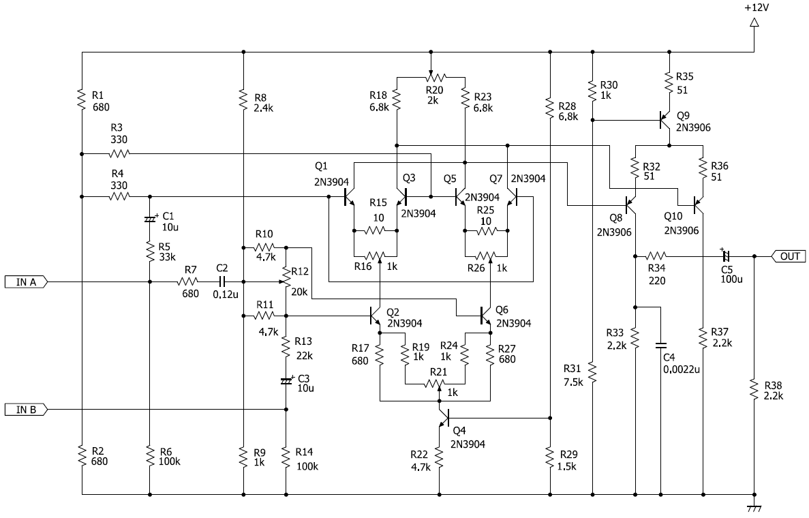

# リング・モジュレータ

## 概要

リングモジュレータは、ピッチ感はあるのに音階がはっきりしない音を作るのに向いているモジュールです。2系統の入力と一系統の出力を持ちます。2つの入力を掛け合わせて出力を得ます。

## このディレクトリに含まれるリソース

- ring_modulator.ce3: 回路図ファイル (BSch3v)
- gate_delay_sch.pdf, gate_delay_sch.png: 回路図イメージファイル

## 回路図

